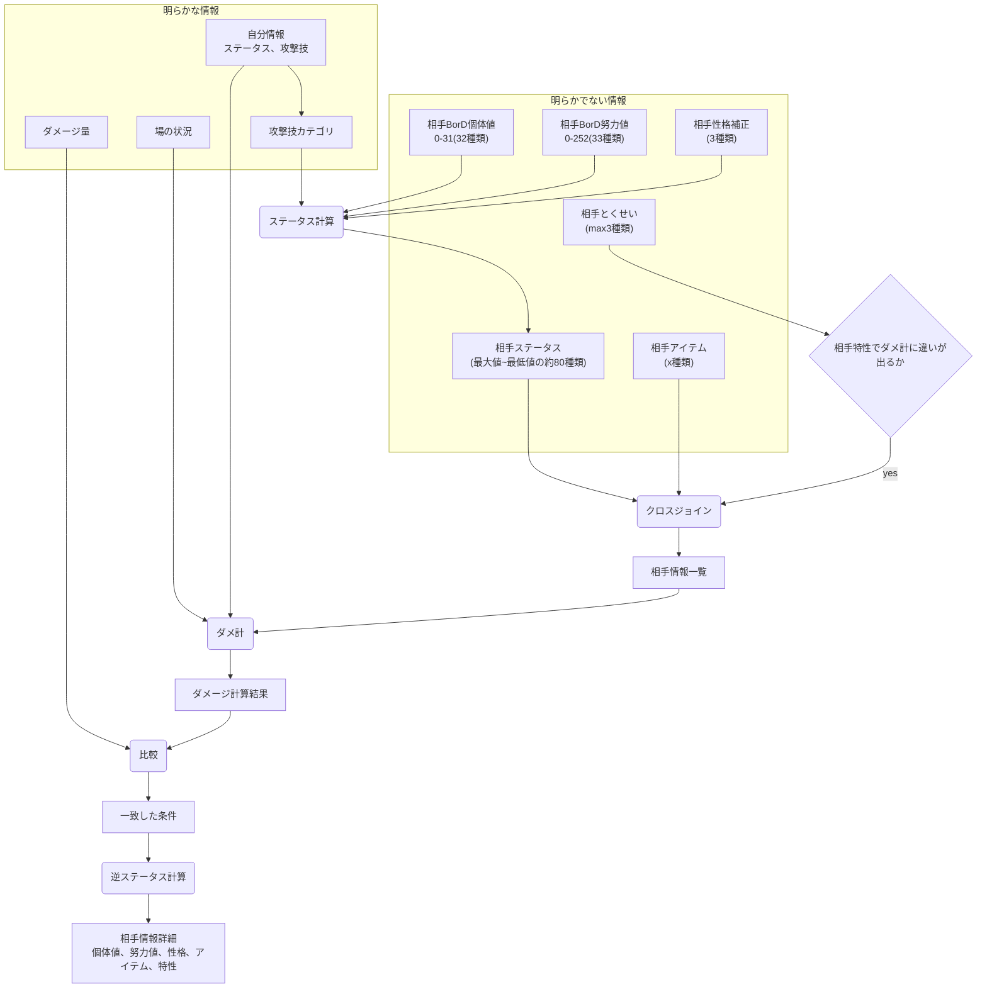
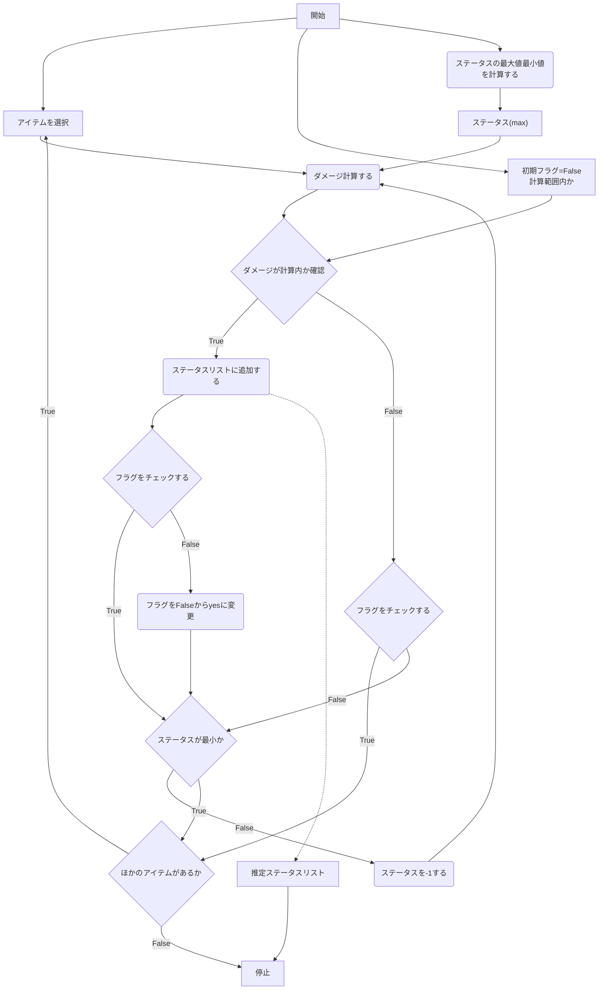

# ダメージ感覚ツール(仮称)
被ダメージや与ダメージから相手ポケモンのステータスや持ち物を推定するツール。  
機能としてはステータスやアイテムの推測だが、ポケモン対戦勢になじみある用語**ダメ感**をツール名に着けたいと思い命名。

## やりたいこと
対戦時の明らかな情報とダメージ量から、明らかでない情報をダメージ計算結果から推定する。  
明らかな情報をインプット。明らかでない情報は全パターンインプット。その計算結果とダメージ量を比較することで推定できるはず。  
明らかor明らかでない情報は状況によって変わるが以下の3パターンで分類できそう。

|攻撃サイド|ダイマックス|パターン|
|----|----|----|
|自分|Yes|1|
|自分|No|1|
|相手|Yes|2|
|相手|No|3|

## 各パターンでの情報分類
各パターンでダメ計に必要な値のうち何が明らかかを箇条書き。  
基本的には相手のポケモン能力値、アイテム、特性がわからない。相手がダイマックスする場合は、技の威力やカテゴリが不明になる。
### パターン1(自分が攻撃側)
#### 明らかな情報
- 攻撃側(自分)の全情報
- フィールド
- 天候
- 壁
- HP変化割合(おおよそ)
#### 明らかでない情報
- 防御側の個体値、努力値
- 防御側の性格
- 防御側のアイテム
- 防御側のとくせい
### パターン2(相手が攻撃側でダイマックス)
#### 明らかな情報
- 防御側(自分)の全情報
- フィールド
- 天候
- 壁
- ダメージ量
#### 明らかでない情報
- 攻撃側の個体値、努力値
- 攻撃側の性格
- 攻撃側のアイテム
- 攻撃側のとくせい
- **攻撃側の技詳細(威力など)**
### パターン3(相手が攻撃側で通常状態)
#### 明らかな情報
- 防御側(自分)の全情報
- フィールド
- 天候
- 壁
- **攻撃側のわざ**
- ダメージ量
#### 明らかでない情報
- 攻撃側の個体値、努力値
- 攻撃側の性格
- 攻撃側のアイテム
- 攻撃側のとくせい

## フローチャート
パターン1についてフローチャートを考えた。その他パターンも似たフローになるはず。

ダメ計～比較のフローチャート
